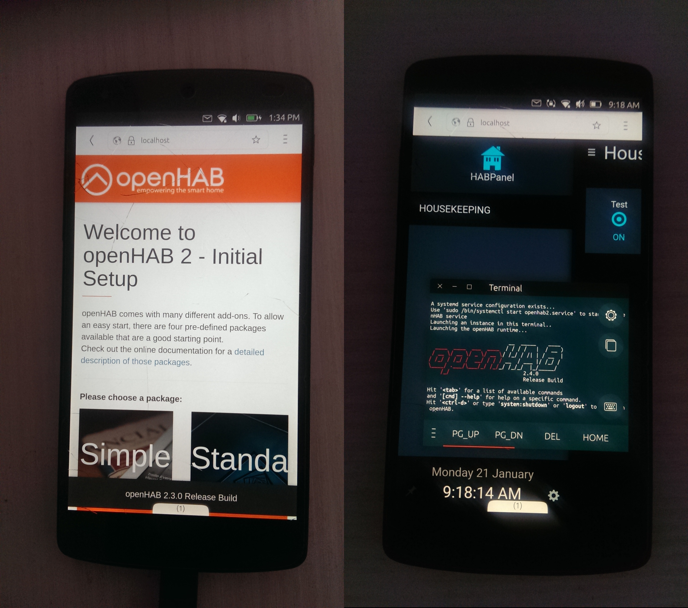

# OpenHAB on Nexus 5

Install Ubuntu Touch
--------------------
On a linux desktop get the UBports installer:
`user@ubuntu-desktop$ snap install ubports-installer`
... and then run it
`user@ubuntu-desktop$ ubports-installer`
See [alternative methods](https://github.com/ubports/ubports-installer/) if you do not have snap.

Once UT is running on the device, go in Settings => About and activate Developer Mode. You will need to set a passcode for Developer Mode

From the desktop connect through adb or ssh to the device:
`user@ubuntu-desktop$ adb shell`

Create a container
------------------
`phablet@ubuntu-phablet:~$ libertine-container-manager create -i openhab`

Install Java
------------
`phablet@ubuntu-phablet:~$ libertine-container-manager exec -i openhab -c bash`
`root@ubuntu-phablet:/# apt-get install openjdk-8-jdk`

For Oracle JDK:
`
root@ubuntu-phablet:/# wget https://download.oracle.com/otn-pub/java/jdk/8u201-b09/42970487e3af4f5aa5bca3f542482c60/jdk-8u201-linux-arm32-vfp-hflt.tar.gz
root@ubuntu-phablet:/# tar zxvf jdk-8-linux-arm32-vfp-hflt.tar.gz -C /opt
root@ubuntu-phablet:/# update-alternatives --install /usr/bin/javac javac /opt/jdk1.8.0/bin/javac 1
root@ubuntu-phablet:/# update-alternatives --install /usr/bin/java java /opt/jdk1.8.0/bin/java 1
root@ubuntu-phablet:/# update-alternatives --config javac
root@ubuntu-phablet:/# update-alternatives --config java
root@ubuntu-phablet:/# java -version
`
Install OpenHAB
---------------`
root@ubuntu-phablet:/# wget -qO - 'https://bintray.com/user/downloadSubjectPublicKey?username=openhab' | sudo apt-key add -'
root@ubuntu-phablet:/# apt-get install apt-transport-https
root@ubuntu-phablet:/# echo 'deb https://dl.bintray.com/openhab/apt-repo2 stable main' | sudo tee /etc/apt/sources.list.d/openhab2.list
root@ubuntu-phablet:/# apt-get update
root@ubuntu-phablet:/# apt-get install openhab2
root@ubuntu-phablet:/# apt-get install openhab2-addons
`
Start OpenHAB
Still in the container run:
`root@ubuntu-phablet:/# /usr/bin/openhab-cli start`
Point the Nexus 5 browser to:
`http://localhost:8080`

Configuration files for OpenHAB are stored in /home/phablet/.cache/libertine-container/xenial/rootfs/etc/openhab2/.
To use scp (or WinSCP) to access this folder from the desktop, configure ssh:
`
user@ubuntu-desktop$ ssh-keygen
user@ubuntu-desktop$ adb push ~/.ssh/id_rsa.pub /home/phablet/
user@ubuntu-desktop$ adb shell
phablet@ubuntu-phablet:~$ mkdir /home/phablet/.ssh
phablet@ubuntu-phablet:~$ chmod 700 /home/phablet/.ssh
phablet@ubuntu-phablet:~$ cat /home/phablet/id_rsa.pub >> /home/phablet/.ssh/authorized_keys
phablet@ubuntu-phablet:~$ chmod 600 /home/phablet/.ssh/authorized_keys
phablet@ubuntu-phablet:~$ chown -R phablet.phablet /home/phablet/.ssh
phablet@ubuntu-phablet:~$ sudo android-gadget-service enable ssh
user@ubuntu-desktop$ ssh phablet@ubuntu-phablet
`
Issues
------
JVM crashes
